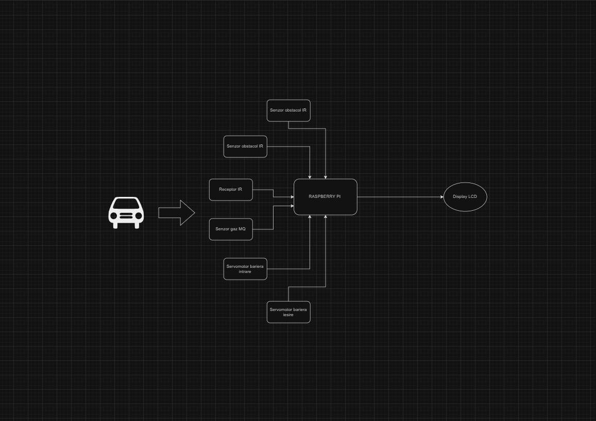
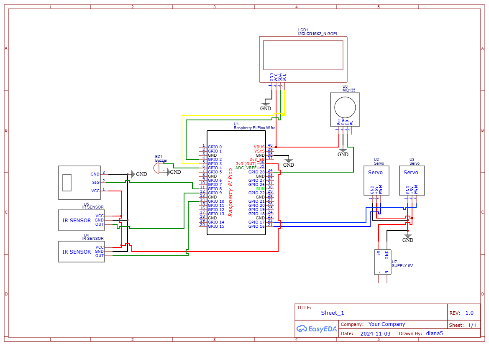

# Car-Parking-System

## Descriere
Implementarea unui sistem de parcare inteligent utilizând placa Raspberry Pi Pico permite gestionarea eficientă și interactivă a numărului de mașini parcate, cu afișarea mesajelor de informare pe un ecran LCD.

Sistemul are o capacitate maximă de 4 mașini, iar numărul locurilor disponibile și cel al mașinilor parcate sunt actualizate și afișate în timp real. La intrarea în parcare, un senzor IR detectează prezența unei mașini, iar bariera se ridică doar după confirmarea prin apăsarea unui buton pe telecomandă, cu condiția să mai existe locuri disponibile. Ieșirea din parcare este gestionată automat prin intermediul unui al doilea senzor IR, care detectează mașina în mișcare, ridică bariera și actualizează numărul locurilor disponibile. 

În plus, sistemul este echipat cu un senzor de fum care detectează prezența gazului sau fumului, declanșând un mod de urgență. În acest mod, barierele se ridică automat pentru a permite evacuarea rapidă, iar ecranul LCD afișează un mesaj de avertizare pentru părăsirea parcării.

## Componente utilizate
- **Raspberry Pi Pico**
- **Display LCD 16x2**, conectat printr-un driver I2C pentru reducerea numărului de conexiuni necesare.  
- **Servomotor 180° cu limitator**, utilizat pentru controlul barierei.  
- **2 senzori obstacole IR**.  
- **Modul IR receptor cu telecomandă**.  
- **Senzor de gaz și buzzer**, pentru a simula o alarmă în caz de incendiu.

## Schema bloc
O reprezentare detaliată a componentelor și conexiunilor principale: 

## Schema electrică
Conexiunile electrice dintre componente au fost proiectate astfel încât să respecte cerințele funcționale: 

## Schema PCB
Proiectarea plăcii PCB, incluzând traseele electrice și poziționarea componentelor:  

## Design software
Pentru realizarea și implementarea proiectului, am utilizat următoarele medii de dezvoltare:  
- **Arduino IDE** pentru scrierea și implementarea codului sursă.  
- **Easy EDA** pentru proiectarea schemei electrice si a placii PCB.  
- **Draw.io Online** pentru crearea schemei bloc.
